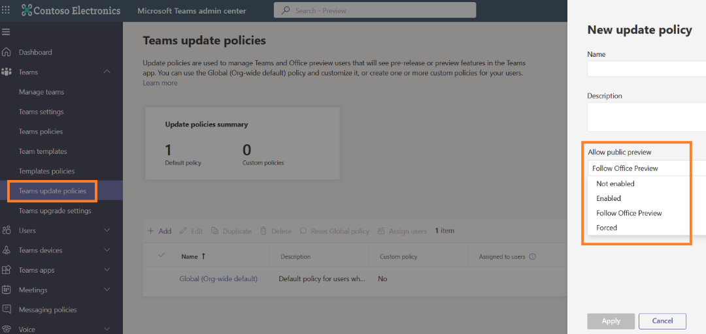

# Microsoft Teams Public Preview

> [!NOTE] 
> Features included in preview might not be complete and could undergo changes before becoming available in the public release. They're provided for evaluation and exploration purposes only. The preview features aren't supported in Office 365 Government Community Cloud (GCC).

Public Preview for Microsoft Teams provides early access to unreleased features in Teams. Previews allow you to explore and test upcoming features. We also welcome feedback on any feature in public previews. Public preview is enabled per Team user, so you don't need to worry about affecting your entire organization.

For a list of what's available in the Teams public preview, visit [Microsoft Teams Public Preview tech notes](https://techcommunity.microsoft.com/t5/microsoft-teams-public-preview/bd-p/MicrosoftTeamsPublicPreview).

## Set the Update policy

Public preview is enabled on a per-user basis, and the option to turn on public preview is controlled in an admin policy. Update policies are used to manage Teams and Office preview users who will see pre-release or preview features in the Teams app. You can use the Global (Org-wide default) policy and customize it, or create one or more custom policies for your users. The policy needs to be assigned to specific users because it doesn't over-write the global policy.

1. Sign in to the [Microsoft Teams admin center](https://admin.teams.microsoft.com/).

2. Select **Teams** > **Teams Update policies**.

1. Select **Add** to create a new policy or select an existing policy to open **Update policy**.

2. Name the update policy, add a description, and select the setting for **Show preview features**.

   -   **Follow Office Preview** (default)
       - This new default option will automatically enable Teams Public Preview features for any user enrolled in Office Current Channel (Preview). 
       - There are no more actions required by the end user.
       
   -   **Enabled**
       - This option enables Teams Public Preview regardless of whether a user is enrolled in Office Current Channel (Preview). 
       - The end user must also opt in to Teams public preview in their Teams app.

   > [!NOTE]  
   > For existing users in Teams Public Preview who are NOT in the **Current Channel (Preview)**, IT admins need to switch from default, **Follow Office Preview** to **Enabled**.
 
   - **Not enabled** 
     - Teams Public Preview features will not be available to end users.

   -  **Forced** 
       - This option enables Teams Public Preview for the end user.
       - There is no action required by the end user.
       
      

You can also set the policy using the PowerShell `Set-CsTeamsUpdateManagementPolicy` cmdlet with the `-AllowPublicPreview` parameter.

## Enable public preview

To enable public preview on a desktop or web client, you need to complete the following tasks:

1. Select the three dots to the left of your profile to display the Teams menu.
2. Select **About** > **Public preview**.
3. Select **Switch to Public preview**.

> [!NOTE]  
> This option is only available when **Allow public preview** is set to **Enabled**.

### Public preview for Microsoft Teams Rooms on Windows

Public preview is off by default. When public preview is on, end-users have access to features that are in public preview on enabled Teams Rooms. To turn on public preview, add ```<EnablePublicPreview>True</EnablePublicPreview>``` to your XML configuration file.

We recommend enrolling 5-10 devices to public preview. 

All public preview features are announced at [Microsoft Teams Public Preview - Microsoft Tech Community](https://techcommunity.microsoft.com/t5/microsoft-teams-public-preview/bd-p/MicrosoftTeamsPublicPreview).

### Public Preview Indicator

Users who are in the Public Preview  will see **EA** next to their profile picture indicating that they have **E**arly **A**ccess to Teams features (as shown in the below image). 


## Related topics

[Public developer preview](/microsoftteams/platform/resources/dev-preview/developer-preview-intro)
