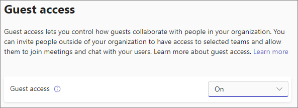

# Turn guest access in Microsoft Teams on or off

This article describes how to configure guest access settings - including calls, meetings, and chat - in Teams. Guest access in Teams also requires configuring other settings in Microsoft 365, including settings in Azure AD, Microsoft 365 Groups, and SharePoint. If you're ready to start inviting guests to teams, read one of the following:

- To configure guest access for Teams for general use, see [Collaborate with guests in a team](/microsoft-365/solutions/collaborate-as-team).
- To collaborate with a partner organization that uses Azure Active Directory and allow guests to self-enroll for team access, see [Create a B2B extranet with managed guests](/microsoft-365/solutions/b2b-extranet).

> [!NOTE]
> If you just want to find, call, chat, and set up meetings with people in other organizations, use [external access](trusted-organizations-external-meetings-chat.md).

## Configure guest access in the Teams admin center

1. Sign in to the [Microsoft Teams admin center](https://admin.teams.microsoft.com/).

2. Select **Users** > **Guest access**.

3. Set **Allow guest access in Teams** to **On**.

    

4. Under **Calling**, **Meeting**, and **Messaging**, select **On** or **Off** for each capability, depending on what you want to allow for guests.

      - **Make private calls** – Turn this setting **On** to allow guests to make peer-to-peer calls.
      - **IP video** - Turn this setting **On** to allow guests to use video in their calls and meetings.
      - **Screen sharing mode** – This setting controls the availability of screen sharing for guests.
          - Turn this setting to **Disabled** to remove the ability for guests to share their screens in Teams.
          - Turn this setting to **Single application** to allow sharing of individual applications.
          - Turn this setting to **Entire screen** to allow complete screen sharing.
      - **Meet Now** – Turn this setting **On** to allow guests to use the Meet Now feature in Microsoft Teams.
      - **Edit sent messages** - Turn this setting **On** to allow guests to edit messages they previously sent.
      - **Delete sent messages** – Turn this setting **On** to allow guests to delete messages they previously sent.
      - **Delete chat** - Turn this setting **On** to allow guests to delete an entire chat conversation.
      - **Chat** – Turn this setting **On** to give guests the ability to use chat in Teams.
      - **Giphy in conversations** – Turn this setting **On** to allow guests to use Giphys in conversations. Giphy is an online database and search engine that allows users to search for and share animated GIF files. Each Giphy is assigned a content rating.
      - **Giphy content rating** –  Select a rating from the drop-down list:
          - **Allow all content** - Guests will be able to insert all Giphys in chats, regardless of the content rating.
          - **Moderate** - Guests will be able to insert Giphys in chats, but will be moderately restricted from adult content.
          - **Strict** – Guests can insert Giphys in chats, but will be restricted from inserting adult content.
      - **Memes in conversations** - Turn this setting **On** to allow guests to use Memes in conversations.
      - **Stickers in conversations** – Turn this setting **On** to allow guests to use stickers in conversations.
      - **Immersive reader for messages** - Turn this setting **On** to allow guests to use [immersive reader in Teams](https://support.microsoft.com/topic/a700c0d0-bc53-4696-a94d-4fbc86ac7a9a).

    

5. Select **Save**.

> [!NOTE]
> If you're an administrator, and you're having trouble with Guest Access in Microsoft Teams, select **Run Tests** below, which will populate the Guest Access diagnostic in the Microsoft 365 Admin Center. These tests will check your configuration and quickly recommend next steps to enable Guest Access for your tenant.
>> [!div class="nextstepaction"]
>> [Run Tests: Guest Access](https://aka.ms/TeamsGuestAccessDiagDMC)

## Turning guest access off

If you turn guest access off in Teams, existing guests lose access to their team. However, they are not removed from the team. They are still visible to people in the team and can be @mentioned. If you turn Teams guest access on again, they will regain access.

If you plan to leave guest access off, you may want to advise your team owners to manually remove the guest accounts from their teams. While these guests won't have access, having their accounts visible in the team could lead to confusion for other people in the team.

## See also

[Set up secure collaboration with Microsoft 365](/microsoft-365/solutions/setup-secure-collaboration-with-teams)

[Block guests from a specific team](/microsoft-365/solutions/per-group-guest-access)

[Set-CsTeamsClientConfiguration](/powershell/module/skype/set-csteamsclientconfiguration)
